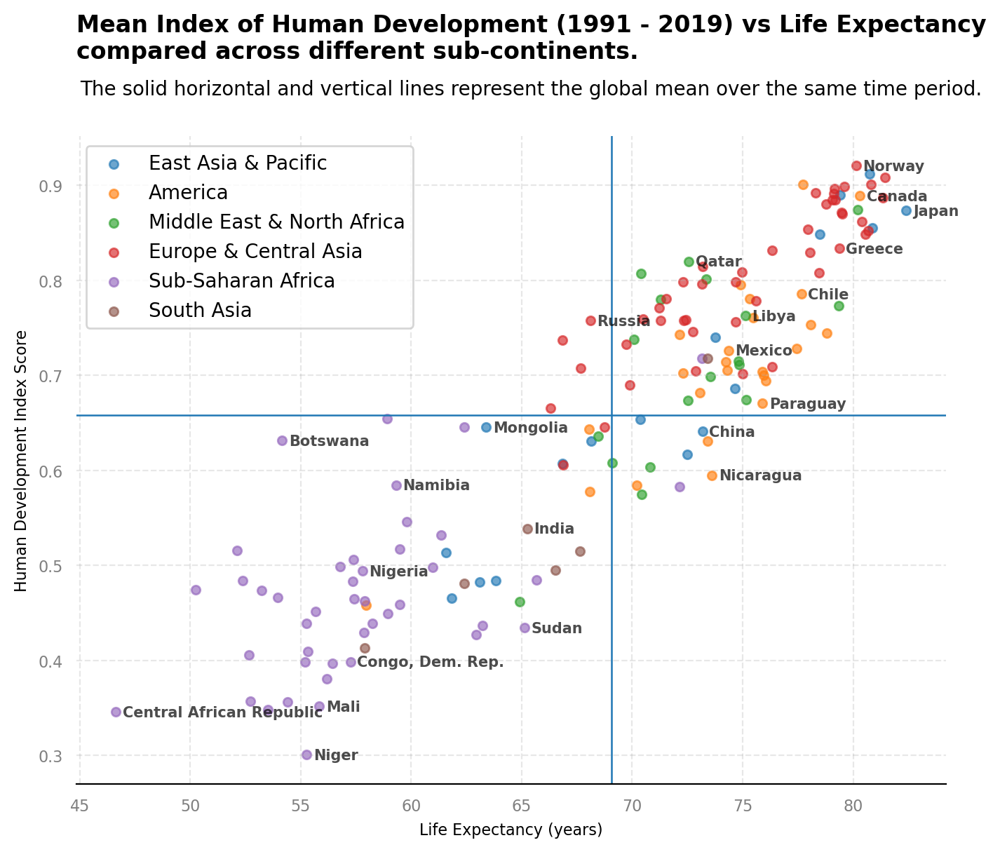

# Gapminder Data Analysis
## Overview
Gapminder has collected a lot of information about how people live their lives in different countries, tracked across the years, on a number of different indicators. 

One indicator of interest is The Human Development Index. An index created to emphasize that people, and their capabilities, should be the ultimate criteria for assessing the development of a country, not economic growth (measured by Gross domestic product) alone.

This project aims to identify how human development has possibly evolved, across different continents of the world, using data collected from Gapminder.

## The Dataset
The dataset comprised several csv files collected from the [Gapminder website](https://www.gapminder.org/data/). Each file contained information about one of the following indicators, recorded for several countries, over the years:
- **Human Development Index (HDI):** An index used to rank countries by level of "human development".
- **Aged 15+ Employment Rate:** Percentage of total population, age group 15+, that has been employed during the given year.
- **Income per person:** Gross domestic product per person adjusted for differences in purchasing power.
- **Life Expectancy:** The average number of years a newborn child would live if current mortality patterns were to stay the same.
- **Babies per woman:** The number of children that would be born to each woman with prevailing age-specific fertility rates.
- **Population Density:** The Average number of people on each square km of the land in the given country.
- **Civil liberties Index (IDEA):** A measure denoting the extent to which civil rights and liberties are respected (on a scale of 1 - 100)
Extra geolocation data for each country was collected from the [Gapminder GitHub page](https://github.com/open-numbers/ddf--gapminder--systema_globalis/blob/master/ddf--entities--geo--country.csv).

## Key Questions
Specifically, the project uses the gathered data to answer three questions:
- What specific metric patterns are common in developed continents and how do they differ from the developing world?
- In the context of the time period analyzed, is it fair to say that Africa is still a developing continent?
- If the second question evaluates true, is the whole of Africa still developing, or only specific parts?

## Key Findings and Conclusion
Human development and life expectancy are highest in Europe and lowest in Africa. Infact, analysis showed that every other continent is better than Africa with regards to these metrics. 

Africa seems affected by increasing birth rates (4 or more children per woman) than many of the worlds other continents. Increasing birth rates do not correlate in a positive way with human development. In developed countries where birth control is the norm, increased quality of life is associated with decreasing fertility rates.

Are these observations enough to classify Africa as a developing continent? It depends. Further analysis shows that not all regions of Africa record low values in human development and life expectancy. Sub-Sahara Africa is where the lowest values of these metrics are recorded. Perhaps, if the continent can capitalize on its high employment rate and embrace technological advancement, the continent could catch up to the rest of the world.   

